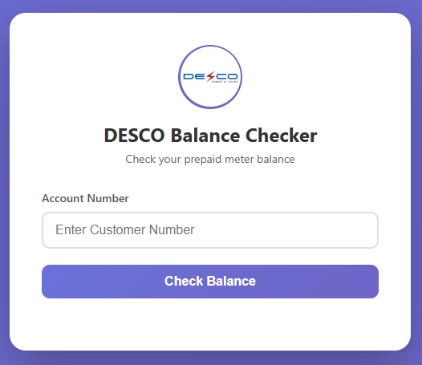
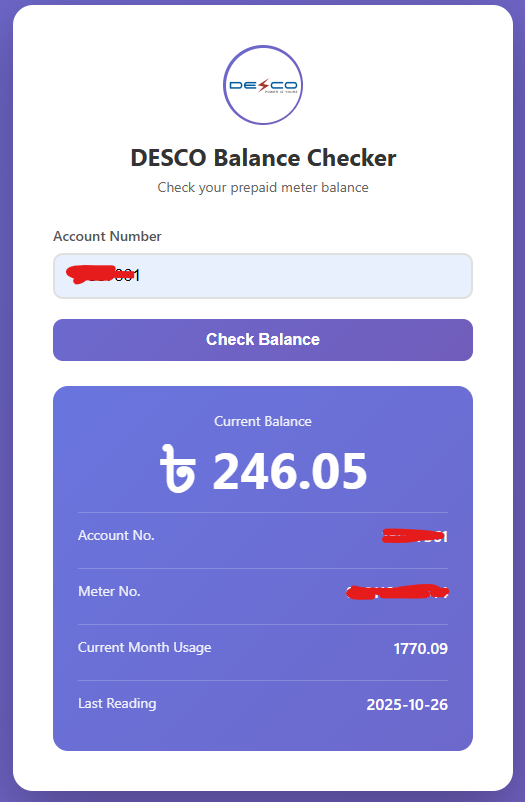

# DESCO Prepaid Meter Balance Checker

A simple static web application for checking DESCO prepaid account balances.

## Overview

This project provides a minimal front-end interface to query DESCO's API for account balance information. It consists of three files: an HTML page for the UI, JavaScript for API interaction and logic, and CSS for styling. The app is designed to be deployed as a static site, such as on GitHub Pages.

## Preview




## API Endpoint

The application interacts with DESCO's prepaid API:

- **Endpoint**: `https://prepaid.desco.org.bd/api/unified/customer/getBalance`
- **Method**: GET
- **Parameters**: 
  - `accountNo` (query string): The DESCO account number to check.
- **Response Format**: JSON
  - Success (code: 200): 
    ```json
    {
      "code": 200,
      "data": {
        "balance": 123.45,
        "accountNo": "123456789",
        "meterNo": "METER123",
        "currentMonthConsumption": 67.89,
        "readingTime": "2023-10-26 14:30:00"
      }
    }
    ```

The app validates the account number input, shows loading indicators, and displays balance, account details, consumption, and reading time upon success.

## Development

- Modify `script.js` for logic changes (e.g., additional API fields).
- Update `style.css` for UI tweaks.
- Use VS Code's Live Server extension for local development.

## Contributing

Contributions welcome! Open issues for bugs or features, submit pull requests for code changes. Keep commits focused and include tests if adding new functionality.
